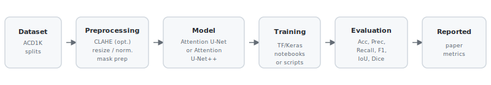

# Deep Learning Models Integrating Attention Mechanisms For Military Camouflaged Object Detection

Official companion repository for the published study on **military camouflaged object detection and segmentation** using **attention-enhanced deep learning** models on the **ACD1K** dataset.

[](https://www.python.org/)
[](https://www.tensorflow.org/)
[](https://opencv.org/)
[](https://github.com/gulkaraman/Deep-Learning-Models-Integrating-Attention-Mechanisms-For-Military-Camouflaged-Object-Detection)
[](https://www.scopus.com/)
[](LICENSE)
[](https://jupyter.org/)

**Repository:** [github.com/gulkaraman/Deep-Learning-Models-Integrating-Attention-Mechanisms-For-Military-Camouflaged-Object-Detection](https://github.com/gulkaraman/Deep-Learning-Models-Integrating-Attention-Mechanisms-For-Military-Camouflaged-Object-Detection)

## Highlights

- Published in a **Scopus-indexed** journal (*El-Cezeri Journal of Science and Engineering*)
- Focused on **military camouflaged object** detection and **pixel-wise segmentation**
- Uses the **ACD1K** adaptive camouflage dataset (bring your own copy; not bundled here)
- Evaluates **Attention U-Net with ResNet-50** and **Attention U-Net++** with attention gates
- Provides both **notebook-based** experiment archives and a **modular script pipeline** under `src/`
- Reports **Accuracy** and **IoU** (among other metrics) with clear separation between **paper values** and **local reproduction**

## Table of Contents

- [Overview](#overview)
- [Research Motivation](#research-motivation)
- [Article Information](#article-information)
- [Repository Highlights](#repository-highlights)
- [Visual Overview](#visual-overview)
- [Project Structure](#project-structure)
- [Methodology](#methodology)
- [Experimental Configurations](#experimental-configurations)
- [Published Results](#published-results)
- [Reproducibility](#reproducibility)
- [Installation](#installation)
- [Usage](#usage)
- [Citation](#citation)
- [Acknowledgments](#acknowledgments)
- [Turkish Summary](#turkish-summary)

## Overview

**Why is this hard?** Camouflaged objects are designed to mimic background texture, colour, and scale. Local contrast at boundaries is often weak, so classical pipelines (thresholding, edge filters alone) frequently fail.

**What this study does.** The work trains and evaluates **deep convolutional segmentation** models that combine **strong encoders** (ResNet-50) with **attention mechanisms** to emphasise informative spatial locations along skip connections.

**Which models?** Two families are central: **Attention U-Net** (U-shaped decoder with attention-gated skips) and **Attention U-Net++** (nested skip pathways with attention).

**What you will find here.** Root-level **Jupyter notebooks** (ablation naming encodes optimiser / dropout / CLAHE choices), **documentation** in `docs/`, **diagrams** in `mimariler/`, a reproducible **`config/`** layout, and a **Python package** under `src/` for script-based training and evaluation.

## Research Motivation

Military camouflaged objects are frequently embedded in **cluttered natural scenes**. Foreground and background can share **low-level statistics**, which reduces separability for hand-crafted cues.

For that reason, this repository studies **attention-enhanced CNN segmenters** that learn hierarchical representations and **selectively fuse** multi-scale features. **IoU-focused** assessment is emphasised alongside accuracy, because overlap-based metrics better reflect **mask quality** when class imbalance or large background regions are present.

## Article Information

### Table 1 — Article metadata

| Field | Details |
| --- | --- |
| Title | Deep Learning Models Integrating Attention Mechanisms For Military Camouflaged Object Detection |
| Journal | *El-Cezeri Journal of Science and Engineering* |
| Indexing | **Scopus-indexed** journal |
| Year | 2026 |
| Volume / Issue | 13 (2) |
| Pages | 146–160 |
| DOI | [10.31202/ecjse.1747013](https://doi.org/10.31202/ecjse.1747013) |
| Article link | [DergiPark (English article page)](https://dergipark.org.tr/en/pub/ecjse/article/1747013) |
| Authors | Nilgün Şengöz, Gül Karaman, Mert Samet Çeliker, Nazmi Yücel Çan |

## Repository Highlights

This repository is structured for **three audiences**: readers of the paper who want artefacts, practitioners who will re-run notebooks, and engineers who prefer a **CLI-driven** workflow.

- **Paper-aligned configs** under `config/` (including `paper_attention_unet_clahe_adamax.yaml` and `paper_attention_unetpp_adam.yaml`)
- **Rich documentation** (`docs/`) for dataset layout, preprocessing, models, training, metrics, results, and reproducibility notes
- **Visual assets** (`mimariler/`) illustrating architectures and workflow context
- **Scripted pipeline** (`src/training`, `src/evaluation`) that mirrors notebook logic without deleting the original notebooks

## Visual Overview

### Attention U-Net (conceptual diagram)


*Illustrative diagram bundled with the repository: U-shaped decoder with skip connections and attention-style fusion (see notebooks and `src/models/attention_unet.py` for the implemented graph).*

### Attention U-Net++ (conceptual diagram)


*Illustrative diagram for the nested / dense skip pathway variant evaluated in the `att-unet++*.ipynb` series and `src/models/attention_unet_plus_plus.py`.*

### End-to-end pipeline (repository overview)



*Simplified operational flow aligned with the documentation: data are preprocessed, models are trained (notebooks or scripts), metrics are computed, and headline values are reported in the paper (`docs/RESULTS.md`).*

## Project Structure

```text
.
├── README.md
├── LICENSE
├── CITATION.cff
├── requirements.txt
├── .gitignore
├── config/
│   ├── example_config.yaml
│   ├── paper_attention_unet_clahe_adamax.yaml
│   └── paper_attention_unetpp_adam.yaml
├── docs/
│   ├── assets/readme/pipeline_overview.svg
│   ├── DATASET.md
│   ├── MODEL_ARCHITECTURE.md
│   ├── PREPROCESSING.md
│   ├── TRAINING.md
│   ├── EVALUATION_METRICS.md
│   ├── RESULTS.md
│   └── REPRODUCIBILITY.md
├── mimariler/
├── checkpoints/          # local only; tracked via .gitkeep (see .gitignore)
├── outputs/              # local predictions/metrics/figures; .gitkeep placeholders
├── src/                  # modular training / evaluation code
├── att unet *.ipynb      # Attention U-Net experiment notebooks
└── att-unet++*.ipynb     # Attention U-Net++ experiment notebooks
```

## Methodology

### Dataset

The study uses **ACD1K** (Adaptive Camouflage Dataset) for supervised **image–mask** learning. The dataset is **not vendored** in this repository; see `docs/DATASET.md` for directory conventions and acquisition notes.

### Preprocessing

Pipelines include **resize**, **intensity normalisation**, **binary mask thresholding**, and optional **CLAHE** in the LAB colour space (see `docs/PREPROCESSING.md` and `src/data/preprocessing.py`). Some notebooks enable **Albumentations** geometric augmentation; the script trainer currently focuses on the core loading path (see `docs/REPRODUCIBILITY.md` for notebook–script differences).

### Model Architectures

- **Attention U-Net + ResNet-50:** ImageNet initialised encoder with multi-scale skips and **attention gates** that suppress low-salience background responses (`src/models/attention_unet.py`).
- **Attention U-Net++ + ResNet-50:** **Nested skip** fusion with attention for richer multi-scale mixing (`src/models/attention_unet_plus_plus.py`).

### Training Strategy

Notebooks historically drive **K-fold** and `model.fit` loops with callbacks (checkpoints, early stopping, CSV logs). The `src/training/train.py` entry point trains on explicit `train/` and `val/` splits from YAML—consult `docs/TRAINING.md` and `docs/REPRODUCIBILITY.md` before expecting a bit-for-bit match to every notebook run.

### Evaluation Metrics

Segmentation quality is assessed with **Accuracy, Precision, Recall, F1-score, IoU, and Dice** (see `docs/EVALUATION_METRICS.md` and `src/training/metrics.py`). **IoU** is highlighted because it directly measures **spatial overlap** between predicted and reference masks.

## Experimental Configurations

### Table 2 — Configuration summary (high level)

| Model | Backbone | Preprocessing | Optimizer | Learning Rate | Dropout | Workflow Type |
| --- | --- | --- | --- | --- | --- | --- |
| Attention U-Net | ResNet-50 | CLAHE / non-CLAHE variants | Adam / Adamax / Adadelta variants | `1e-5` in headline paper configuration | `0.2` / `0.5` notebook variants | Notebook + Script |
| Attention U-Net++ | ResNet-50 (nested skips) | CLAHE / non-CLAHE variants | Adam / Adamax / Adadelta variants | `1e-5` in headline notebook filenames (`att-unet++-*-lr=1e-5-*`) | `0.2` / `0.5` notebook variants | Notebook + Script |

**Notes.**

- Notebook filenames encode major ablations (optimiser, dropout, CLAHE on/off). Always open the notebook header cells for the exact compile block used in a run.
- YAML files under `config/` capture **representative** script settings; adjust paths before training on your machine.

## Published Results

### Table 3 — Headline metrics (as reported in the paper)

| Model | Preprocessing | Optimizer | Learning Rate | Dropout | Accuracy | IoU | Interpretation |
| --- | --- | --- | --- | --- | ---: | ---: | --- |
| Attention U-Net / ResNet-50 | CLAHE | Adamax | `1e-5` | `0.2` | 96.88% | 92.01% | Higher **IoU** supports **segmentation-centric** deployment (better overlap / boundary fidelity). |
| Attention U-Net++ | Paper text: “similar experimental setup” (see article PDF for exact wording) | Adam | `1e-5` (matches `att-unet++-adam-lr=1e-5-*` notebooks and `config/paper_attention_unetpp_adam.yaml`) | Paper table shows “—”; several primary notebooks use `0.2` (e.g. `droput=0,2` in filenames—confirm spelling vs. paper table) | 98.32% | 82.09% | Higher **accuracy** is attractive when **global pixel correctness** dominates the operational criterion. |

**Discussion.** No single scalar tells the whole story: **IoU** penalises both missed foreground and bloated predictions, whereas **accuracy** can be influenced by class balance. **Choose the model and preprocessing chain based on mission constraints** (mask quality vs. aggregate correctness).

## Reproducibility

- **Notebook path:** run the relevant `*.ipynb` end-to-end after configuring local dataset paths.
- **Script path:** `python -m src.training.train --config ...` with the `dataset/train` and `dataset/val` layout described in `docs/DATASET.md`.
- **Dataset requirement:** full training and quantitative reproduction require you to supply **ACD1K** locally; this repository intentionally excludes raw imagery.
- **Paper metrics:** headline **Accuracy / IoU** numbers above are **as published**; rerunning scripts without the official split and seeds may yield different values.
- **Notebook vs. script parity:** some notebook-only choices (e.g. extended K-fold schedules, certain callback monitor names) may differ slightly from the scripted defaults—see the “Notebook-to-script migration notes” in `docs/REPRODUCIBILITY.md`.

## Installation

```bash
git clone https://github.com/gulkaraman/Deep-Learning-Models-Integrating-Attention-Mechanisms-For-Military-Camouflaged-Object-Detection.git
cd Deep-Learning-Models-Integrating-Attention-Mechanisms-For-Military-Camouflaged-Object-Detection
```

```bash
python -m venv .venv
```

**Windows (PowerShell)**

```powershell
.\.venv\Scripts\Activate.ps1
```

**macOS / Linux**

```bash
source .venv/bin/activate
```

```bash
pip install -U pip
pip install -r requirements.txt
```

## Usage

### A) Notebook-based usage

1. Launch Jupyter (`jupyter lab`).
2. Open the desired `att unet *.ipynb` or `att-unet++*.ipynb` notebook.
3. Point the notebook `PATH` variables to your local **ACD1K** split.
4. Execute cells sequentially.

### B) Script-based usage

From the repository root:

```bash
python -m src.training.train --config config/paper_attention_unet_clahe_adamax.yaml
```

```bash
python -m src.evaluation.evaluate --config config/paper_attention_unet_clahe_adamax.yaml --checkpoint checkpoints/attention_unet_paper.keras --split test
```

```bash
python -m src.evaluation.predict --config config/paper_attention_unet_clahe_adamax.yaml --checkpoint checkpoints/attention_unet_paper.keras --input path/to/images --output outputs/predictions
```

## Citation

**DOI:** [https://doi.org/10.31202/ecjse.1747013](https://doi.org/10.31202/ecjse.1747013)

```bibtex
@article{Sengoz2026CamouflagedObjectDetection,
  title={Deep Learning Models Integrating Attention Mechanisms For Military Camouflaged Object Detection},
  author={{\c{S}}eng{\"o}z, Nilg{\"u}n and Karaman, G{\"u}l and {\c{C}}eliker, Mert Samet and {\c{C}}an, Nazmi Y{\"u}cel},
  journal={El-Cezeri Journal of Science and Engineering},
  volume={13},
  number={2},
  pages={146--160},
  year={2026},
  doi={10.31202/ecjse.1747013}
}
```

Plain-text author line (for quick copy): Nilgün Şengöz, Gül Karaman, Mert Samet Çeliker, Nazmi Yücel Çan.

A machine-readable citation file is also provided in `CITATION.cff`.

## Acknowledgments

We would like to thank our supervisor, co-authors, and colleagues for their valuable support and contributions throughout this research.

## Turkish Summary

Bu çalışma, askeri kamufle nesnelerin tespiti ve segmentasyonu için attention mekanizmalarıyla güçlendirilmiş derin öğrenme modellerini değerlendirmektedir. ACD1K veri seti üzerinde Attention U-Net / ResNet-50 ve Attention U-Net++ mimarileri incelenmiş; doğruluk ve IoU sonuçları karşılaştırılmıştır. Çalışma, Scopus’ta indekslenen *El-Cezeri Journal of Science and Engineering* dergisinde yayımlanmıştır.
