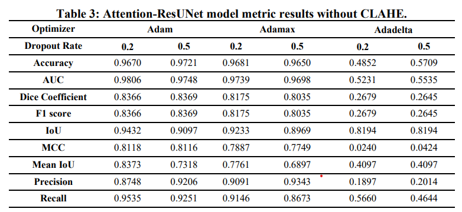
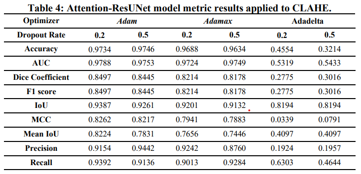
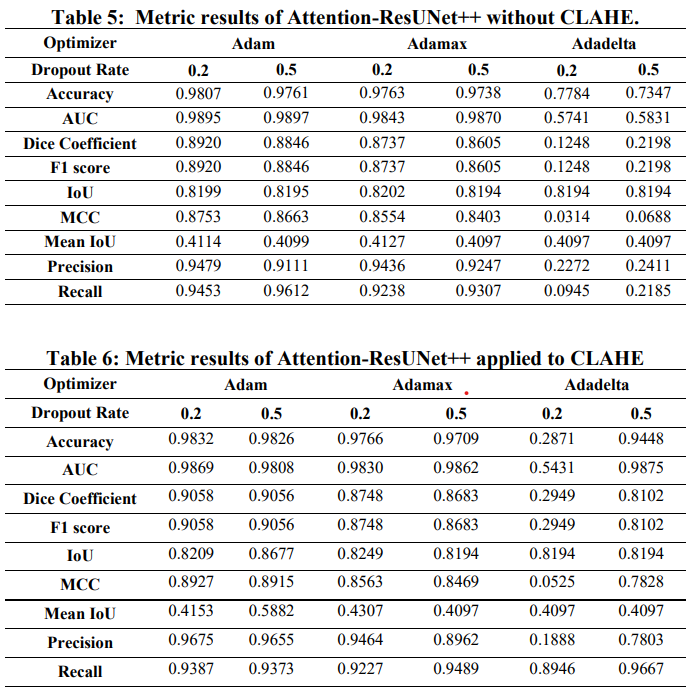
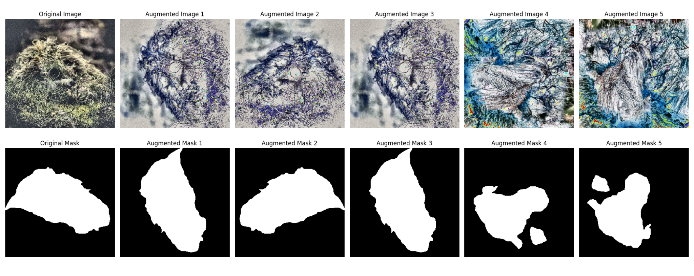

# Deep Learning Models Integrating Attention Mechanisms For Military Camouflaged Object Detection

Official companion repository for the published study on military camouflaged object detection and segmentation using attention-enhanced deep learning models on the ACD1K dataset.

[](https://www.python.org/)
[](https://www.tensorflow.org/)
[](https://opencv.org/)
[](https://jupyter.org/)
[](https://github.com/gulkaraman/Deep-Learning-Models-Integrating-Attention-Mechanisms-For-Military-Camouflaged-Object-Detection)
[](https://www.scopus.com/)
[](LICENSE)

**Repository:** [github.com/gulkaraman/Deep-Learning-Models-Integrating-Attention-Mechanisms-For-Military-Camouflaged-Object-Detection](https://github.com/gulkaraman/Deep-Learning-Models-Integrating-Attention-Mechanisms-For-Military-Camouflaged-Object-Detection)

## Highlights

- Published in a **Scopus-indexed** journal (*El-Cezeri Journal of Science and Engineering*)
- Focused on **military camouflaged object detection and segmentation**
- Uses the **ACD1K Adaptive Camouflage Dataset** (not bundled; configure local paths)
- Evaluates **Attention-ResUNet** and **Attention-ResUNet++** style architectures (ResNet-50 encoder with attention; see notebooks and `src/models/`)
- Includes **CLAHE** and **non-CLAHE** experimental settings
- Compares **Adam**, **Adamax**, and **Adadelta** optimizers (plus dropout ablations in notebooks)
- Provides **notebook-based** experiments and a **script-based** modular pipeline under `src/`

## Table of Contents

- [Article Information](#article-information)
- [Visual Results and Experimental Tables](#visual-results-and-experimental-tables)
- [Experimental Configuration Summary](#experimental-configuration-summary)
- [Published Results Summary](#published-results-summary)
- [Methodology](#methodology)
- [Project Structure](#project-structure)
- [Installation](#installation)
- [Usage](#usage)
- [Reproducibility](#reproducibility)
- [Citation](#citation)
- [Acknowledgments](#acknowledgments)
- [Turkish Summary](#turkish-summary)

## Article Information

| Field | Details |
| --- | --- |
| Title | Deep Learning Models Integrating Attention Mechanisms For Military Camouflaged Object Detection |
| Journal | El-Cezeri Journal of Science and Engineering |
| Indexing | Scopus-indexed |
| Year | 2026 |
| Volume / Issue | 13(2) |
| Pages | 146–160 |
| DOI | [10.31202/ecjse.1747013](https://doi.org/10.31202/ecjse.1747013) |
| Article Link | [https://dergipark.org.tr/en/pub/ecjse/article/1747013](https://dergipark.org.tr/en/pub/ecjse/article/1747013) |
| Authors | Nilgün Şengöz, Gül Karaman, Mert Samet Çeliker, Nazmi Yücel Çan |

## Visual Results and Experimental Tables

The figures below are **exported result tables and augmentation examples** from the study materials. **Numerical values are read directly from the images**; for authoritative typesetting, refer to the [published PDF](https://dergipark.org.tr/en/pub/ecjse/article/1747013).

### Table 3: Attention-ResUNet without CLAHE



This table presents the metric results of the **Attention-ResUNet** model **without CLAHE** preprocessing under **Adam**, **Adamax**, and **Adadelta** optimizers with **different dropout rates**.

### Table 4: Attention-ResUNet with CLAHE



This table presents the **Attention-ResUNet** results after applying **CLAHE** preprocessing. It helps evaluate how **contrast enhancement** affects segmentation and classification-related metrics.

### Tables 5 and 6: Attention-ResUNet++ with and without CLAHE



These tables summarize the **Attention-ResUNet++** metric results for both **non-CLAHE** and **CLAHE-based** experimental settings.

### Data Augmentation Examples



This figure shows **original image–mask pairs** and **augmented samples** used to increase data diversity during training.

## Experimental Configuration Summary

| Model | Preprocessing | Optimizers | Dropout Rates | Key Evaluation Metrics |
| --- | --- | --- | --- | --- |
| Attention-ResUNet | With and without CLAHE | Adam, Adamax, Adadelta | 0.2, 0.5 | Accuracy, AUC, Dice, F1-score, IoU, MCC, Mean IoU, Precision, Recall |
| Attention-ResUNet++ | With and without CLAHE | Adam, Adamax, Adadelta | 0.2, 0.5 | Accuracy, AUC, Dice, F1-score, IoU, MCC, Mean IoU, Precision, Recall |

## Published Results Summary

Headline values below match the **paper’s highlighted comparisons** (see `docs/RESULTS.md`). **Do not** treat every notebook row as identical to these headline figures—full ablations are in the experimental tables above.

| Model | Best Highlighted Configuration | Accuracy | IoU | Interpretation |
| --- | --- | ---: | ---: | --- |
| Attention-ResUNet | CLAHE + Adamax + learning rate 1e-5 + dropout 0.2 | 96.88% | 92.01% | Stronger for **segmentation-focused** usage due to high **IoU** |
| Attention-ResUNet++ | Adam-based **reported** configuration in the paper | 98.32% | 82.09% | Stronger for **overall accuracy–oriented** evaluation |

## Methodology

### Dataset

The experiments use the **ACD1K (Adaptive Camouflage Dataset)** for paired **RGB images** and **pixel-wise masks**. The raw dataset is **not redistributed** in this repository; see `docs/DATASET.md` for folder layout and acquisition notes.

### Preprocessing

Images are resized and normalized; masks are binarized. **CLAHE** in the LAB colour space is applied in selected runs to improve local contrast (see `docs/PREPROCESSING.md` and `src/data/preprocessing.py`). Notebooks may include additional **Albumentations** augmentations (see figure above).

### Model Architectures

**Attention-ResUNet** denotes a ResNet-50 encoder with an attention-augmented U-shaped decoder (`att unet *.ipynb`, `src/models/attention_unet.py`). **Attention-ResUNet++** denotes the nested skip variant with attention (`att-unet++*.ipynb`, `src/models/attention_unet_plus_plus.py`). Diagrams in `mimariler/` illustrate the high-level topology.

### Training Strategy

Training is implemented in **TensorFlow / Keras** with experiment-specific optimisers and dropout. Notebooks historically include **K-fold** and rich callback logging; the **script pipeline** (`src/training/train.py`) trains on explicit `train/` and `val/` splits from YAML—see `docs/TRAINING.md` and `docs/REPRODUCIBILITY.md` for differences.

### Evaluation Metrics

Models are evaluated with **Accuracy, Precision, Recall, F1-score, IoU, Dice**, and additional notebook metrics such as **AUC, MCC, Mean IoU** (`docs/EVALUATION_METRICS.md`, `src/training/metrics.py`). **IoU** is particularly informative for **mask overlap** quality in camouflaged segmentation.

## Project Structure

```text
.
├── README.md
├── LICENSE
├── CITATION.cff
├── requirements.txt
├── .gitignore
├── config/
├── docs/
│   ├── assets/readme/          # README figures (tables, augmentation, pipeline.svg)
│   └── …                       # DATASET, MODEL_ARCHITECTURE, TRAINING, etc.
├── src/                        # Script-based training & evaluation
├── mimariler/                  # Architecture diagrams (PNG)
├── checkpoints/                # Local weights (gitignored patterns; .gitkeep only)
├── outputs/                    # Local metrics / predictions / figures (.gitkeep placeholders)
├── att unet *.ipynb            # Attention-ResUNet experiment notebooks
└── att-unet++*.ipynb           # Attention-ResUNet++ experiment notebooks
```

## Installation

```bash
git clone https://github.com/gulkaraman/Deep-Learning-Models-Integrating-Attention-Mechanisms-For-Military-Camouflaged-Object-Detection.git
cd Deep-Learning-Models-Integrating-Attention-Mechanisms-For-Military-Camouflaged-Object-Detection
```

```bash
python -m venv .venv
```

**Windows (PowerShell):** `.\.venv\Scripts\Activate.ps1`  
**macOS / Linux:** `source .venv/bin/activate`

```bash
pip install -U pip
pip install -r requirements.txt
```

## Usage

### Notebook-based usage

1. Install dependencies and launch Jupyter.  
2. Open the relevant `att unet *.ipynb` or `att-unet++*.ipynb` notebook.  
3. Set dataset `PATH` variables to your local **ACD1K** split.  
4. Run cells sequentially.

### Script-based usage

From the repository root:

```bash
python -m src.training.train --config config/paper_attention_unet_clahe_adamax.yaml
```

```bash
python -m src.evaluation.evaluate --config config/paper_attention_unet_clahe_adamax.yaml --checkpoint checkpoints/attention_unet_paper.keras --split test
```

```bash
python -m src.evaluation.predict --config config/paper_attention_unet_clahe_adamax.yaml --checkpoint checkpoints/attention_unet_paper.keras --input path/to/images --output outputs/predictions
```

## Reproducibility

- **Notebooks** preserve the original experiment archive (optimiser / dropout / CLAHE naming in filenames).  
- **Scripts** mirror core training logic but may differ in **data split** and **K-fold** behaviour—read `docs/REPRODUCIBILITY.md`.  
- **Paper headline metrics** in *Published Results Summary* are fixed reporting values; reproducing them requires the official dataset setup and matching protocol.

## Citation

```bibtex
@article{Sengoz2026CamouflagedObjectDetection,
  title={Deep Learning Models Integrating Attention Mechanisms For Military Camouflaged Object Detection},
  author={Şengöz, Nilgün and Karaman, Gül and Çeliker, Mert Samet and Çan, Nazmi Yücel},
  journal={El-Cezeri Journal of Science and Engineering},
  volume={13},
  number={2},
  pages={146--160},
  year={2026},
  doi={10.31202/ecjse.1747013}
}
```

Machine-readable metadata: `CITATION.cff`.

## Acknowledgments

We would like to thank our supervisor, co-authors, and colleagues for their valuable support and contributions throughout this research.

## Turkish Summary

Bu çalışma, askeri kamufle nesnelerin tespiti ve segmentasyonu için attention mekanizmalarıyla güçlendirilmiş derin öğrenme modellerini değerlendirmektedir. ACD1K veri seti üzerinde Attention-ResUNet ve Attention-ResUNet++ mimarileri incelenmiş; CLAHE ve CLAHE'siz deneyler karşılaştırılmıştır. Çalışma, Scopus'ta indekslenen El-Cezeri Journal of Science and Engineering dergisinde yayımlanmıştır.
